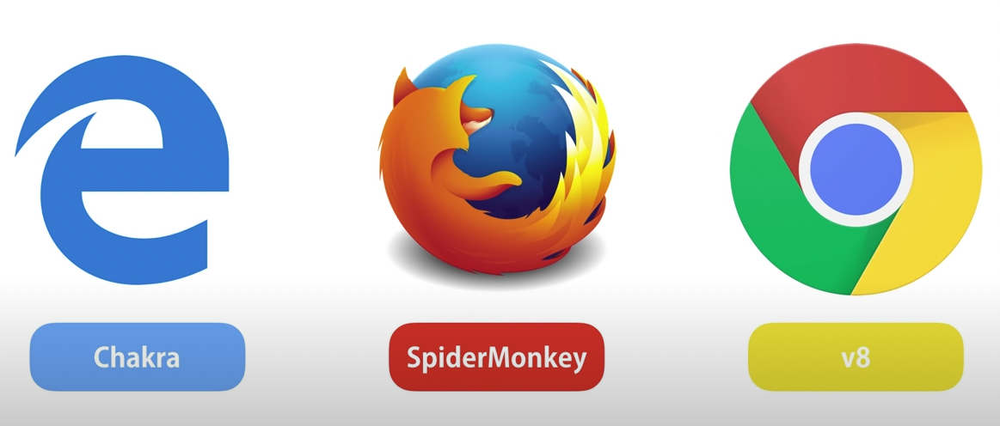

# NODE JS {


Cuando hablamos de [NODE JS](https://nodejs.org/es/) estamos haciendo referencia a un programa que podemos instalar en nuestro ordenado. Básicamente es JS en backend o JS ejecutado en nuestra consola (sin necesidad de un navegador web que lo interprete).

- ❌ No es un lenguaje de programación
- ❌ No es un framework
- ✅ Es un entorno de ejecución de código abierto disponible para múltiples plataformas que nos permite ejecutar JS fuera de un navegador. Generalmente lo encontraremos en el desarrollo de servicios back-end o APIs. Esta tecnología es ideal para:
  - Aplicaciones escalables
  - Aplicaciones con gran tráfico de datos
  - Aplicaciones en tiempo real

Pero lo más importante es que NODEJS posee una de las mayores comunidades que genera código open source.

> `API`: Es un acrónimo que hace referencia interfaz de programación de aplicaciones. Una API establece un conjunto de subrutinas, funciones y procedimientos que permiten la comunicación entre dos o más componentes de software distintos.

`JS en el frontend`: Los navegadores poseen un intérprete de JS y lee y trabaja nuestros ficheros con la extensión .js. Por ejemplo, V8 es el motor de Chrome (escrito en C++) que ejecuta nuestro código. Los navegadores se descargan el JS y el JavaScript Engine hace de intermediario para traducirlo a machine Code en un proceso llamado `Just-In-Time Compiler`.

<p align="center">
  
</p>

`JS en el backend (NODEJS)`: se trata de un entorno JavaScript (programa de comandos) de lado de servidor que utiliza un modelo asíncrono y dirigido por eventos. Estamos hablando de una máquina virtual ligera y potente donde uno de los puntos fuertes es su capacidad de mantener muchas conexiones abiertas y esperando. Es decir: la capacidad de `interpretar código JS y ejecutarlo` sin necesidad de depender de un navegador.

En 2009, Ryan Dahl tuvo la idea de poder emplear JS sin necesidad de un navegador. Por ello mismo, tomó en motor V8 del navegador de Chrome y lo embebió en un programa escrito en C++ al que llamaría Node.exe. Este ejecutable viene acompañado de una serie de utilidades no disponibles en los navegadores, como por ejemplo:

- fs.readFile()
- http.createServer()

> Desarrolladores de NODEJS: https://www.joyent.com/

## Getting started

Para verificar su instalación en nuestro equipo desde la terminal:

```bash
node --version
```

En caso de no tenerlo instalado podemos acudir a [nodejs.org](https://nodejs.org/en/) para descargarlo en nuestro equipo.

Una de las principales ventajas es que dentro de NODEJS el código se organiza en `paquetes` o funcionalidades de código desarrolladas por terceros. Lo mejor para consultar y descargar dichos paquetes es acudir a la página oficial de [npmjs.com](https://www.npmjs.com/). Se trata de una `web de gestión de paquetes` donde podemos encontrar código de terceros que podemos descargarnos en nuestro ordenador para emplearlo.

> `npm`: Node Package Manager (NODEJS ya viene preparado para usar npm).

## Mi primer archivo para NODEJS

Creamos un fichero js:

```bash
touch app.js
```

Escribimos un poco de JS:

> app.js

```js
console.log('Hello world! NODEJS rocks! 🤘');
```

Ejecutamos nuestro nuevo fichero con node:

```bash
node app.js
```

El funcionamiento es exactamente el mismo que con JS:

> app.js

```js
function sayHello(name) {
	console.log(`Hello ${name}`);
}

sayHello('Marcos');
```

## Mi primer paquete de NPM

Ahora vamos a instalar un paquete de terceros en nuestro proyecto. Lo primero que debemos hacer es ejecutar el comando npm que inicia un nuevo proyecto de node y genere un package.json: el archivo que será la hoja de ruta para nuestro proyecto.

```bash
npm init -y
```

En este `package.json` marcará todas las directrices de nuestro proyecto: nombre, configuraciones, paquetes, extenisones, ejecutables... Todo lo que hace que nuestro proyecto funcione. Y lo mejor es que si tienes node y npm instalado en tu ordenador puedes duplicar este proyecto de manera idéntica cuantas veces quieras, y en cualqueir ordenador.

> package.json

```json
{
	"name": "ca-nodejs",
	"version": "1.0.0",
	"type": "module",
	"description": "nodejs",
	"main": "app.js",
	"scripts": {
		"start": "node random/app.js"
	},
	"keywords": [],
	"author": "",
	"license": "ISC",
	"dependencies": {
		"chalk": "^5.1.2"
	}
}
```

Ahora vamos a instalar el paquete de npm [chalk](https://www.npmjs.com/package/chalk):

```bash
npm i chalk
```

En este punto vemos que se han generado una serie de nuevos ficheros:

- `package.json`: indica las dependencias de mi código. No es necesario que te pase todo el código: solo seguir esta "guía de instalación".
- `node_modules`: aquí encontraré los paquetes descargados. Podemos encontrar el código original más las dependencias propias. OJO: esta carpeta no debemos añadirla a git nunca. Debemos incluirla en `.gitignore`.
- `package-lock.json`: detalle extenso de todo lo instalado.

> Emplea [gitignore.io](https://www.toptal.com/developers/gitignore) para generar ficheros .gitignore profesionales y completos.

> app.js

```js
import chalk from 'chalk';

console.log(chalk.blue('Hello world! NODEJS rocks!🤘'));
```

```bash
node app.js
```

Podemos aprovechar los scripts del fichero package.json para establecer la ejecución de nuestros ficheros:

> package.json

```json
	"scripts": {
		"start": "node app.js"
	},
```

En la ficha de cada uno de los paquetes de npm que descarguemos desde la página `[npmjs.com](https://www.npmjs.com/) podemos observar que:

- Muchos paquetes de npm tienen su propio GitHub
- Se indica el número de veces que se ha descargado dicho paquete
- Se indica el número de dependencias (paquetes de dependen de otros paquetes) del mismo

> TIP: A mayor número de descargas, dependencias y documentación, mejor y más seguro presumiblemente será el paquete que descarguemos.

## Mi primer proyecto con NPM

Vamos a descargar [lodash](https://www.npmjs.com/package/lodash): un paquete de npm que es la navaja suiza del desarrollo en js.

> Incluímos eslint como librería de código.

```bash
npm i lodash
npm i eslint
npm init @eslint/config
```

> app.js

```js
import chalk from 'chalk';
import _ from 'lodash';

console.log(chalk.red('Bienvenid@ al sorteo de regencia para los reyes godos'));

const aspirantes = [
	'Alarico I',
	'Ataúlfo',
	'Sigérico',
	'Walia',
	'Teodorico',
	'Turismundo',
];
// const randomNumber = Math.ceil(Math.random() * aspirantes.length - 1);
// const ganador = aspirantes[randomNumber];
const ganador = _.sample(aspirantes);
console.log(chalk.blue(`El nuevo rey visigodo es ${ganador} 👑`));
```

## Comandos

- `npm init`: Solo se usa la primera vez que creo un proyecto para crear el archivo `package.json` (igual que `git init`).

- `npm install` o `npm i`: Instala las dependencias del proyecto leyendolas desde el archivo de definicion del proyecto `package.json`. Lo emplearemos cuando heredemos un `package.json` de otro proyecto.

- `npm install <nombre_paquete>`: Instala una dependencia o paquete de código. Además escribe esa dependencia para que quede registrada en el `package.json`.

- `npm install express`: Instala Express en el directorio seleccionado.

- `npm run start` o `npm start`: Arranca el script `start` definido en el `package.json`.

- `npm run dev`: Arranca el script de `dev`, que es la configuración de desarrollo con nodemon habilitado.

- `npm init -y`: nos permite saltarnos todas las preguntas sobre el proyecto.

## Parcel para mi primera página web con NODEJS

Instalamos un programa en NODE que me permita `crear un servidor` y arrancar ese servidor escuchando en el puerto indicado. De esta manera vamos a construir nuestra primera página web con un servidor de node en el back.

```bash
npm install parcel
```

> package.json

```json
  "scripts": {
    "web": "parcel web/index.html"
  }
```

> index.html

```html
<!DOCTYPE html>
<html lang="en">
	<head>
		<meta charset="UTF-8" />
		<meta http-equiv="X-UA-Compatible" content="IE=edge" />
		<meta name="viewport" content="width=device-width, initial-scale=1.0" />
		<link rel="stylesheet" href="./style.css" />
		<script src="./script.js"></script>
		<title>Document</title>
	</head>
	<body>
		<div id="root">
			<h1>Hello world! This is my first web project on node server 🚀</h1>
		</div>
	</body>
</html>
```

> style.css

```css
body {
	margin: 0;
}
#root {
	border: 1px solid #963f27;
	padding: 10px;
	background-color: #fee1d9;
}
```

> script.js

```js
/* eslint-disable no-undef */
window.addEventListener('load', () => {
	// do things after the DOM loads fully
	console.log('Everything is loaded');
});
```

## Mi servidor

URL del servidor:

> `<protocolo>://<dominio>:[<puerto>]`

Si no ponemos [<puerto>], se pone por defecto el puerto por defecto:

- HTTP: 80
- HTTPS: 443

Existen 2 etapas:

1. resolver nombre de dominio
2. endpoint (url)

`Un servidor es un programa que entiende un protocolo determinado (escucha peticiones HTTP)`, con el cual me puedo comunicar y recibir respuestas. Al ser un programa puedo arrancar tantos servidores como quiera. El servidor debe de estar escuchando y cada uno de los puertos de mi ordenador puede tener un programa (una dirección IP tiene 65536 puertos). Yo voy a colocar un programa en el puerto 1234 (es una convención):

`Accedemos a http://localhost:1234/`: significa ve a localhost (mi propio ordenador) y conectate al programa del puerto 1234. Puertos por debajo del 1024 están protegidos por contraseña de admin.

- `FRONTEND`: console del servidor.
- `BACKEND`: en mi terminal.

Pestaña `NETWORK` del navegador:

- `HEADERS`: están la cabecera de las preguntas y en reesponses la respuesta del servidor.

- `TIMING`: duración de las peticiones.

- `response.headers > user.agents`: tenemos mucha info interesante que recibe el servidor.

- `response headers`: X-Powered-By Express.

- Request Method `GET`(pido cosas) y `POST` (pido cosas y mando cosas).

- `STATUS`: 200 (ok). Es decir, en el servidor se ha generado respuesta y se ha podido enviar. Otros: 404 (not found).

¡Y así funciona internet!

## Nodemon

Es un paquete que vuelve a arrancar el servidor cuando cambia un fichero (vigila nuestro node y si hay cambios, reinicia).

```bash
npm install nodemon
```

En desarrollo, se suele usar npm run dev:

```js
  "dev": "nodemon src/app.js",
  "start": "node src/app.js"
```

> 🐮 Crea tu primer proyecto avanzado de NODEJS en el proyecto [cowsay](https://github.com/amargopastor-codealong/ca-cowsay).
